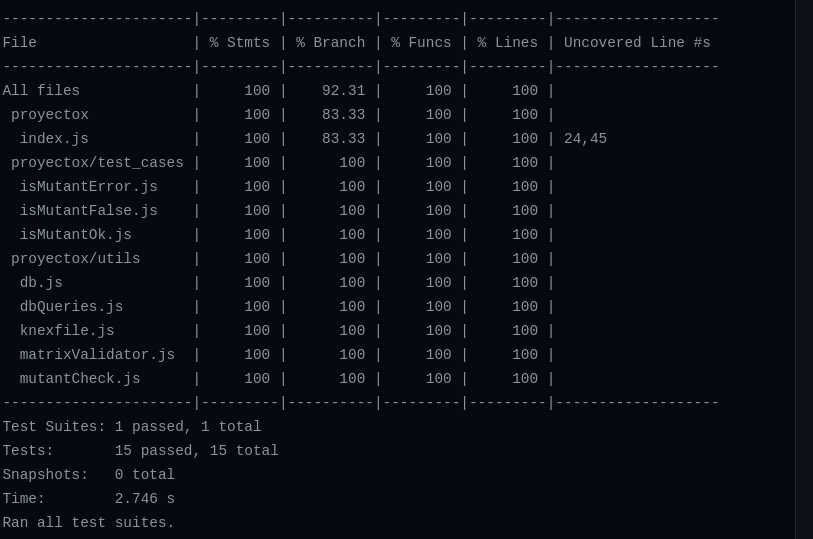
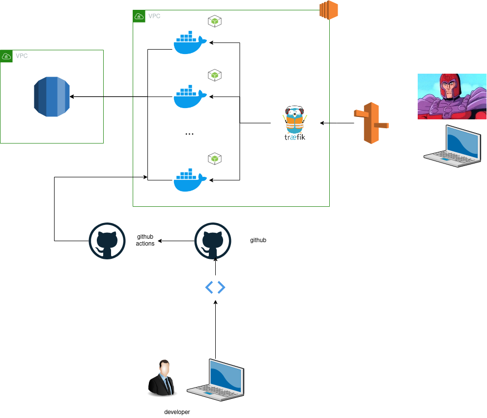
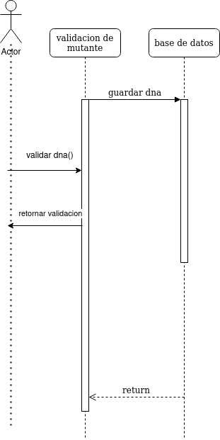
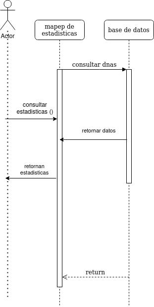

# X-men
## Objetivo:
detectar el gen mutante x dada una cadena de DNA 

## Version local 
### Requisitos

1. docker
2. docker-compose

### Pasos para su ejecucion en local

- `git clone https://github.com/damillano93/xmen`
- `cd xmen`
- `docker-compose up`

### Ejemplo de request local para validar un DNA
`
curl --location --request POST 'localhost:3000/mutant' \
--header 'Content-Type: application/json' \
--data-raw '{
    "dna": [
        "AATGCGCG",
        "CCAGFGCG",
        "TTTATGTG",
        "TAGAAGGA",
        "GCCACTAG",
        "ATCACTGG",
        "CTCACTGG",
        "GGTCACTC"
    ]
}'
`
### Ejemplo de request local para obtener las estadisticas

`curl --location --request GET 'localhost:3000/stats'`

## Version online 
### Rutas
- GET [estado del servicio](https://xmen.damillano.com/health)
- POST [validar un mutante](https://xmen.damillano.com/mutant)
- GET [estadisticas de validacion](https://xmen.damillano.com/stats)

## Test 

### Ejecucion de test en local 

### Requisitos

1. node js
2. postgres
3. base de datos xmen
### Pasos para su ejecucion en local

- `git clone https://github.com/damillano93/xmen`
- `cd xmen`
- `npm i`
- `npm run migrate`
- `npm run test`

para ver resultados del ultimo test [ver](https://github.com/damillano93/xmen/actions)  

## Arquitectura del sistema

### Base de datos (RDS)
- como motor de base de datos se utiliza postgres ejecutado en una instancia de RDS un servicio de bases de datos relacionales de AWS
### Microservicio (API node js) (Server EC2)
- el microservicio esta disenado para ejecutarse en un contenedor en lenguaje Javascript 
- el contenedor se despliega en una instancia de Ec2, un servicio de AWS que provee servidores
- el contenedor es publicado en dockerhub para poder desplegarlo en cualquier servicio
### Proxy Inverso (Traefik)
- el proxy inverso se utiliza para enviar todo el trafico proveniente de la red hacia el contenedor 
- tambien se usa como balanceador de carga para distribuir los request entre las diferentes replicas del contenedor
- filtra el trafico, con el uso de reglas para prevenir ataques
- ayuda a redirecionar el trafico hacia una conexion segura https asi como la administracion de los certificados de seguridad
### Dns (Route 53)
- servicio de aws usado para la resolucion de dominios
### CI (github actions)
- es un servicio de github que permite ejecutar pipelines para permimitir el proceso de entrega continuia
- para nuestro proyecto cumple con 2 funciones
- ejecutar los test de manera automatica para cumplir con los requerimientos del cliente
- crear la imagen del contenedor en dockerhub 
### Ouroboros (Contenedor) [mas info](https://github.com/pyouroboros/ouroboros)
-  contenedor que escucha cuando se crea una nueva version de la imagen del contenedor en dockerhub y la actualiza en el servidor

## Diagrama de secuencia

### validar dna 

### consultar estadistica

